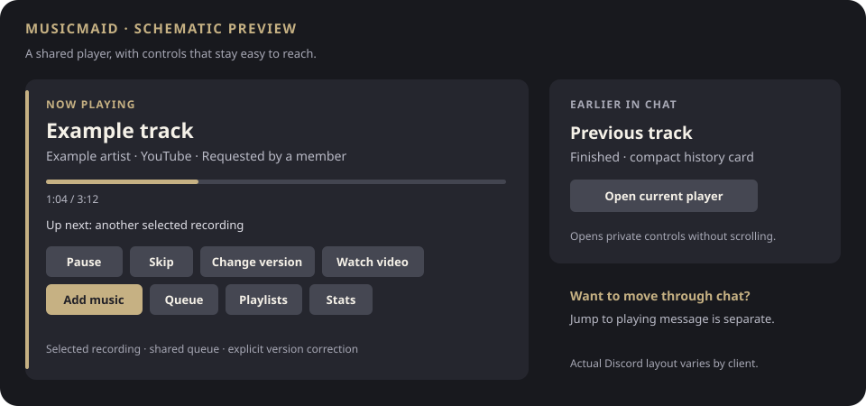

# MusicMaid

[](https://github.com/hagbard2323/musicmaid/actions/workflows/ci.yml)
[](LICENSE)


A self-hosted Discord music bot for one community, with recording selection,
durable queues, saved playlists, moderator recovery and optional synchronized
YouTube video.

**0.1.0-beta.1 · 2026-09-13.** The supported self-hosted installer targets
**AlmaLinux 10 on x86_64**, using your own Discord application and provider
accounts. Automated checks and an AlmaLinux VM installation/recovery exercise
have passed. Independent account setup, extended listening and member/mobile
acceptance remain open. See [validation](docs/VALIDATION.md) for the evidence and
its limits. There is no shared hosted service or uptime guarantee.

## What members get

- **Add music:** one form for a song/link, source selection and optional version review.
- **Predictable selection:** clear matches play directly; uncertain requests show choices. Automatic recovery retains the selected recording.
- **Shared queues:** FIFO or fair turns by requester, with durable playback checkpoints.
- **A music library:** saved tracks/queues, YouTube and Spotify playlist imports, portable JSON sharing and request-based charts.
- **Controls where you are:** full controls on Now playing; older cards open current controls privately without scrolling through chat.
- **Recovery:** moderator diagnostics, same-recording repair, confirmed scoped restarts and an external process watchdog.
- **Optional video:** a Discord Activity follows the selected YouTube video while voice audio remains independent.



*Schematic preview, not a Discord screenshot. Native layout varies by client.*

Source support depends on provider access. Spotify metadata matching and optional
original Spotify audio are different modes; original audio uses an **unofficial
librespot helper**. A source label or bitrate does not prove recording identity or
lossless delivery. Read [Sources](docs/SOURCES.md) before connecting accounts.

## Install for your server

Start with the [self-hosting guide](docs/SELF-HOSTING.md). From a clean reviewed
checkout on the supported host, run as a normal Linux user:

```bash
./scripts/setup.sh
```

The guided menu covers configuration, installation, optional sources/video,
diagnostics, backup, update and rollback. It requests sudo only for protected
operations; builds run as your normal user. Do not run setup itself as root.

Need help? Use [Troubleshooting](docs/TROUBLESHOOTING.md). Members can start with
the [controls guide](docs/COMMUNITY-BETA.md); operators should read
[Operations](docs/OPERATIONS.md).

## Develop

Use Linux and Node.js 22.13+ or 24; CI checks both major versions. These checks need subprocess and local-socket
access, but no live Discord or music-provider credentials:

```bash
npm ci
npm run check
npm test
npm run build
```

[Contributing](CONTRIBUTING.md) covers installer regressions and useful bug
reports. [Architecture](docs/ARCHITECTURE.md) explains the main boundaries.
[Roadmap](docs/ROADMAP.md) separates beta acceptance from proposed features.
[Data policy](docs/DATA-POLICY.md) describes stored information and manual retention.

## License and notices

MusicMaid's original code, documentation and the included profile artwork are
available under [MIT](LICENSE). Dependencies retain their own licenses; see
[third-party notices](THIRD_PARTY_NOTICES.md) and [asset/fixture provenance](NOTICE.md).
The code license does not grant access to provider accounts or rights in media
served by other services. MusicMaid is not affiliated with Discord, YouTube,
Spotify or SoundCloud.
