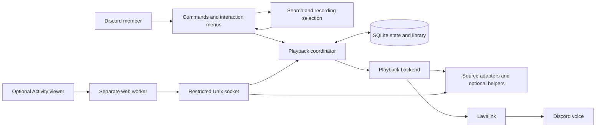

# Architecture

The current release enforces a configured guild before opening production state.
Session reads filter by that guild before decoding snapshots; unrelated stored
data remains inert. Event bookkeeping is published only after its SQLite
checkpoint succeeds. Lock contention waits at most 200 ms per SQLite operation;
slow filesystem I/O itself is not subject to that limit.

Lavalink lookups use Shoukaku's custom REST adapter seam. Caller cancellation and
deadlines cover the response body as well as the headers, with bounded JSON
sizes. Voice/session transport remains owned by Shoukaku and Lavalink.

MusicMaid separates a song request, its selected recording and the temporary
transport used to play it. The supported deployment is one operator-managed
Discord community with local audio services. Internal guild IDs are not a claim
of isolation suitable for a shared hosted service.

## Ownership

| Boundary | Main implementation | Responsibility |
| --- | --- | --- |
| Discord interaction | `apps/bot/src/commands/` | Forms, presentation, voice/moderator access, private menus and stale-action checks. |
| Recording choice | `audio/sources.ts`, `matching.ts`, `ranking.ts`, source adapters | Candidate discovery, identity evidence, exact IDs, source limitations and reload. |
| Playback state | `audio/coordinator.ts`, `model.ts`, `fair-queue.ts` | Per-guild transitions, request/attempt identity, queue policy, retries, checkpoints and recovery. |
| Voice transport | `audio/player-service.ts`, `lavalink.ts` | Shoukaku/Lavalink adaptation, voice readiness, source preparation and backend events. |
| Durable storage | `storage/` | SQLite schema, session snapshots, playlist revisions and request/genre ledger. |
| Optional video | `apps/bot/src/video/`, `apps/viewer-server/`, `apps/viewer/` | Authorized current-track reads, isolated web delivery and client synchronization. |
| Process/release lifecycle | `runtime/`, `scripts/self_host/`, `deploy/` | Heartbeat supervision, release-input validation, privileged setup and transactional recovery. |

Paths beginning with `audio/`, `storage/` or `runtime/` are relative to
`apps/bot/src/`. The optional Rust helper lives in `apps/spotify-stream/`.

## Playback flow

The command layer validates the member's access and searches configured sources.
Clear artist/title matches may play directly; ambiguous candidates require review.
An exact playable link retains its source recording. Matching uses metadata such
as title, artists, duration, version markers and available catalog identifiers;
it is not an audio fingerprint.

The coordinator commits the transition before launching the backend attempt.
Request IDs survive retries and loops; attempt IDs distinguish individual starts.
Backend events must match the active attempt, preventing late callbacks from
advancing or stopping a newer request. State changes, queue policy and checkpoints
are persisted; failed commits must not silently replace live playback.

The backend resolves temporary transport for the selected recording and adapts
voice events to coordinator events. URLs that expire are not the recording's
durable identity. Same-recording retry can refresh transport, but changing the
recording needs a member's choice.

## Failure boundaries

External work is bounded by deadlines, cancellation and capacity limits. YouTube
extractor jobs serialize shared session-file access and retain the lock until
their child process exits; urgent audio can preempt optional video preparation.
Provider cooldowns are shared where account operations share a rate limit.

The coordinator observes progress, early endings and transport failures. Transient
failures get bounded same-recording retries; known restrictions or unresolved
failures lead to explicit alternatives and eventual continuation of the existing
queue. Process responsiveness is supervised separately by systemd's heartbeat
watchdog. Neither mechanism establishes that a human heard the intended track.

The viewer has a separate user, OAuth configuration and restricted Unix interface.
Voice membership authorizes state/media access. Its public surface does not edit
the queue or restart services, and provider grants stay with the bot. Viewer
closure or format failure must not control audio playback.

Installer builds are unprivileged; narrow host operations use sudo and checked
inputs. Runtime, database and relevant service state are restored together on a
failed update. Current refreshed account grants stay separate from older code and
database snapshots. Clean-source manifests identify build inputs; they are not
a cryptographic signature proving who authored a release.

## Deliberate limits

Keep the coordinator, SQLite and independent viewer rather than adding distributed
services before measured need. Synchronous persistence/write amplification,
per-member request budgets and a more consistent typed failure vocabulary remain
useful improvement areas. Shared hosting would additionally need a separate
administration, isolation, quota and data-lifecycle design.

[Validation](VALIDATION.md) describes observed evidence. [Contributing](../CONTRIBUTING.md)
lists the contracts and regression checks expected when changing these boundaries.
